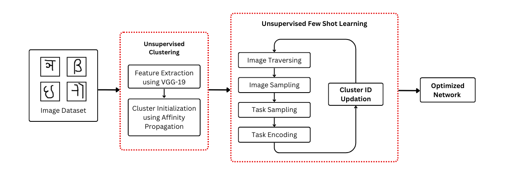
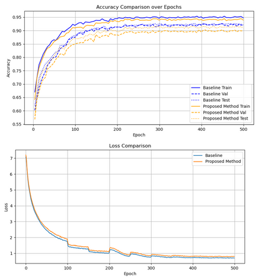
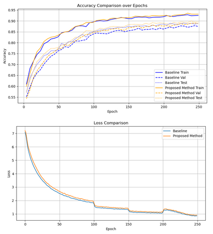

# LF2CS-AffinityPropagation

## Introduction

This project enhances conventional Unsupervised Few-Shot Learning for Image Classification by refining the Learning Feature into Clustering Space (LF2CS) model. Our initiative aims to address the limitations of the original model. The original uses static clustering centers, thus restricting its applicability in scenarios with unknown or highly variable class distributions. We enhance the model by implementing dynamic clustering center determination using Affinity Propagation (AP), which leverages features extracted by the VGG19 model. Our approach significantly increases the model's adaptability and effectiveness across diverse datasets.

## Proposed Modification

We propose a modification to the LF2CS model by replacing its static clustering centers with dynamically determined centers via Affinity Propagation (AP). This modification leverages the powerful feature extraction capabilities of the VGG19 model, enabling the model to adaptively define the number of classes based on the inherent data structure. This approach not only alleviates the need for pre-defining class distributions but also enhances the model's flexibility to efficiently handle class imbalances and changes in data characteristics over time.

### Key Components of the Modification:

- **Dynamic Clustering Centers:** Utilizing AP to dynamically identify and adjust clustering centers based on real-time data analysis.
- **Integration with VGG19:** Feature extraction is performed using the VGG19 model, known for its robustness in capturing essential image characteristics.
- **Enhanced Adaptability:** The model's ability to adapt to new, unseen data scenarios is improved, making it highly suitable for real-world applications where labeled data is scarce.

## Model Architecture

Below is the diagram illustrating the architecture of the proposed method:

## Result

### Model Comparison on Balanced Dataset

Our analysis of the balanced Omniglot dataset revealed that while our model initially shows a slightly higher training loss compared to the baseline, it quickly stabilizes. The accuracy levels are competitive with the baseline, demonstrating the efficacy of our dynamic clustering approach in maintaining high accuracy without manual class specification.

**Model Performance on Balanced Dataset**

### Model Comparison on Imbalanced Dataset

In the imbalanced dataset scenario, our model demonstrated a modest improvement in accuracy over the baseline. This improvement highlights the effectiveness of the Affinity Propagation method in dynamically adjusting to class imbalances, thereby enhancing performance where class distributions are uneven.

**Model Performance on Imbalanced Dataset**

These results underscore the robustness and adaptability of our model, making it a valuable tool for unsupervised learning scenarios where class distributions can vary significantly.

## Reference
The enhancements made in our project build upon the foundational concepts introduced in the following original paper:

- Li, S., Liu, F., Hao, Z., Zhao, K., & Jiao, L. (2022). *Unsupervised Few-Shot Image Classification by Learning Features into Clustering Space*. European Conference on Computer Vision, 420-436, Springer.
